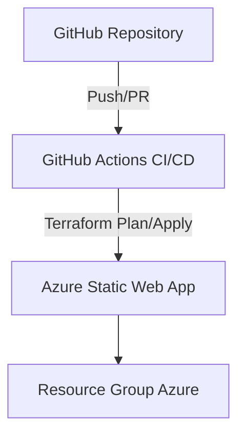

# Azure Static Web App avec Terraform

## Description
Ce projet déploie une Azure Static Web App via Terraform, incluant la gestion des environnements (dev, staging, prod), et s'intègre dans un workflow CI/CD GitHub Actions.

## Architecture


## Prérequis
- Compte Azure avec les permissions adéquates pour créer des ressources (Static Web Apps, Resource Groups)
- Azure CLI installé et configuré
- Terraform >= 1.3.0 installé
- Un Service Principal Azure avec les permissions sur la subscription (pour GitHub Actions)

## Installation
1. Cloner ce repository.
2. Copier `terraform.tfvars.example` en `terraform.tfvars` et ajuster les valeurs.
3. Initialiser Terraform:
   ```
   terraform init
   ```
4. Planifier la création des ressources:
   ```
   terraform plan
   ```
5. Appliquer la configuration:
   ```
   terraform apply
   ```

## Configuration des Variables
- `project_prefix`: Préfixe pour nommer les ressources (3-12 caractères).
- `environment`: Environnement cible (`dev`, `staging`, `prod`).
- `location`: Région Azure.
- `tags`: Tags à appliquer.
- `repository_url`: URL HTTPS du repository GitHub.
- `repository_branch`: Branche GitHub.
- `app_location`: Chemin du dossier frontend.
- `api_location`: Chemin du dossier API.
- `app_artifact_location`: Dossier des artefacts buildés.

## GitHub Actions
### Secrets à configurer
- `ARM_CLIENT_ID`
- `ARM_CLIENT_SECRET`
- `ARM_SUBSCRIPTION_ID`
- `ARM_TENANT_ID`

### Installation du workflow
Copiez le fichier `workflow.yml` dans le répertoire `.github/workflows/` de votre repository.

### Explication du workflow
- Se déclenche sur push et pull request vers `main`.
- Exécute les étapes : formatage, validation, scan sécurité (tfsec), plan, et apply (apply uniquement sur `main`).
- Caches Terraform pour accélérer les runs.
- Commente automatiquement le résultat du plan sur les PR.

## Commandes Terraform
- `terraform init` : Initialise le backend et providers.
- `terraform fmt` : Formate le code.
- `terraform validate` : Valide la configuration.
- `terraform plan` : Montre les modifications.
- `terraform apply` : Applique la configuration.
- `terraform destroy` : Supprime les ressources.

## Exemples d'utilisation
```bash
terraform init
terraform plan -var-file="terraform.tfvars"
terraform apply -var-file="terraform.tfvars"
```

## Troubleshooting
- Assurez-vous que les variables sont correctement configurées.
- Vérifiez les permissions du Service Principal Azure.
- Utilisez `terraform validate` pour détecter les erreurs de configuration.

## Coûts Estimés Azure
Azure Static Web Apps offrent un plan gratuit avec des limitations. Le plan Standard est payant avec un coût lié à l'utilisation des ressources. Veuillez consulter la [page officielle Azure Static Web Apps pricing](https://azure.microsoft.com/pricing/details/app-service/static/) pour plus de détails.
