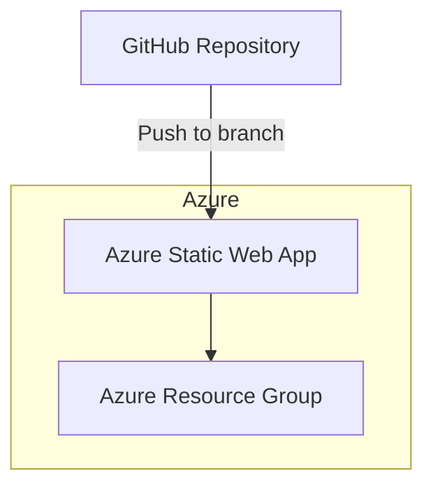

# Azure Static Web App Terraform Module

## Description

This Terraform configuration deploys an Azure Static Web App along with its resource group in a specified Azure region. It supports multiple environments (dev, staging, prod) and integrates with a GitHub repository for continuous deployment.

## Architecture



## Prerequisites

- **Azure CLI** installed and logged in
- **Terraform** version 1.3.0 or higher
- Azure Service Principal with Contributor role on the target subscription
- GitHub Personal Access Token with `repo` permissions for deployment

## Installation

1. Clone this repository.
2. Configure your `terraform.tfvars` file based on the `terraform.tfvars.example` file.
3. Initialize Terraform:

```bash
terraform init
```

## Configuration of Variables

- `prefix`: Prefix for resource naming
- `environment`: Deployment environment, must be one of `dev`, `staging`, or `prod`
- `location`: Azure region (e.g., `westeurope`)
- `sku_tier`: SKU tier for Static Web App (`Free` or `Standard`)
- `repository_url`: GitHub repository URL
- `branch`: Branch to deploy from
- `github_token`: GitHub PAT for deployment
- `app_location`: Path to app source code
- `api_location`: Path to API source code (leave empty if none)
- `output_location`: Build output directory
- `tags`: Map of tags to apply to resources

## GitHub Actions Secrets

Set the following secrets in your GitHub repository settings:

- `ARM_CLIENT_ID`: Azure Service Principal Client ID
- `ARM_CLIENT_SECRET`: Azure Service Principal Client Secret
- `ARM_SUBSCRIPTION_ID`: Azure Subscription ID
- `ARM_TENANT_ID`: Azure Tenant ID
- `GITHUB_TOKEN`: GitHub Personal Access Token (for Static Web App deployment)

## Terraform Commands

- Initialize Terraform:
  ```bash
  terraform init
  ```

- Format Terraform files:
  ```bash
  terraform fmt
  ```

- Validate configuration:
  ```bash
  terraform validate
  ```

- Generate and show an execution plan:
  ```bash
  terraform plan
  ```

- Apply changes:
  ```bash
  terraform apply
  ```

- Destroy infrastructure:
  ```bash
  terraform destroy
  ```

## Example Usage

```hcl
module "static_web_app" {
  source          = "./"
  prefix          = "azstatic"
  environment     = "prod"
  location        = "westeurope"
  sku_tier        = "Standard"
  repository_url  = "https://github.com/your-org/your-static-web-app-repo"
  branch          = "main"
  github_token    = var.github_token
  app_location    = "/"
  api_location    = "api"
  output_location = "build"
  tags = {
    Environment = "prod"
    Project     = "AzureStaticWebApp"
  }
}
```

## Troubleshooting

- Ensure Azure credentials and permissions are correct.
- Verify GitHub token has required scopes.
- Check that the repository URL and branch are correct.
- Review Terraform plan and apply logs for errors.

## Cost Estimation

- Azure Static Web Apps Free tier: free
- Standard tier: paid, cost depends on usage and scale
- Resource group and any associated resources may incur costs

Refer to [Azure Pricing](https://azure.microsoft.com/en-us/pricing/details/app-service/static/) for detailed pricing information.
