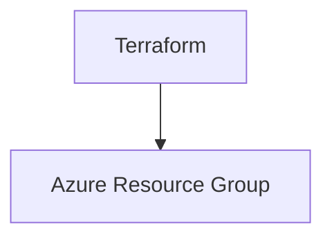

# Terraform Azure Resource Group

## Description

Ce projet Terraform déploie un groupe de ressources Azure configurable selon l'environnement (dev, staging, prod). Il permet une gestion cohérente et reproductible de l'infrastructure.

---

## Architecture déployée



---

## Prérequis

- Azure CLI installé et configuré (https://docs.microsoft.com/fr-fr/cli/azure/install-azure-cli)
- Terraform version >= 1.3.0 (https://developer.hashicorp.com/terraform/downloads)
- Un Service Principal Azure avec les permissions suffisantes pour gérer les ressources (Contributor ou Owner sur la subscription)

Créer un Service Principal et configurer les variables d'environnement:

```bash
az ad sp create-for-rbac --role="Contributor" --scopes="/subscriptions/YOUR_SUBSCRIPTION_ID"
```

Les valeurs retournées (appId, password, tenant) doivent être ajoutées comme secrets GitHub.

---

## Installation

1. Cloner le dépôt
2. Copier `terraform.tfvars.example` en `terraform.tfvars` et adapter les valeurs
3. Initialiser Terraform:

```bash
terraform init
```

---

## Configuration des variables

Les variables configurables sont définies dans `variables.tf` et peuvent être passées via `terraform.tfvars` ou variables d'environnement.

- `resource_group_name` : Nom du groupe de ressources
- `location` : Région Azure
- `environment` : Environnement de déploiement (dev, staging, prod)
- `project_name` : Nom du projet
- `tags` : Tags additionnels (map)

---

## Configuration des secrets GitHub Actions

Dans les paramètres GitHub du dépôt, ajouter les secrets suivants:

- `ARM_CLIENT_ID` : ID de l'application Service Principal
- `ARM_CLIENT_SECRET` : Mot de passe du Service Principal
- `ARM_SUBSCRIPTION_ID` : ID de la subscription Azure
- `ARM_TENANT_ID` : ID du tenant Azure

---

## Commandes Terraform

- Initialiser le projet:

```bash
terraform init
```

- Vérifier la syntaxe et la configuration:

```bash
terraform validate
```

- Formater les fichiers:

```bash
terraform fmt
```

- Voir le plan d'exécution:

```bash
terraform plan
```

- Appliquer les changements:

```bash
terraform apply
```

- Détruire l'infrastructure:

```bash
terraform destroy
```

---

## Exemples d'utilisation

```bash
terraform apply -var='environment=prod' -var='resource_group_name=myproject-rg-prod'
```

---

## Troubleshooting

- Erreurs d'authentification : Vérifier les secrets GitHub et permissions du Service Principal.
- Erreurs de validation : Vérifier la syntaxe et les contraintes des variables.
- Problèmes de connexion Azure : Vérifier la configuration du provider et la connectivité.

---

## Coûts estimés Azure

La création d'un groupe de ressources Azure ne génère pas de coûts directs. Cependant, les ressources créées dans ce groupe peuvent engendrer des coûts. Ce projet ne crée qu'un groupe de ressources vide.

Pour plus d'informations sur la facturation Azure, consultez : https://azure.microsoft.com/fr-fr/pricing/
