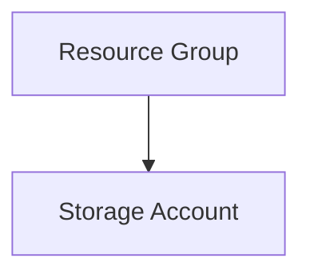

# Projet Terraform Azure Storage Account

## Description

Ce projet Terraform permet de déployer un compte de stockage Azure dans un groupe de ressources dédié. Il supporte la gestion d'environnements (dev, staging, prod) et applique des bonnes pratiques telles que la gestion des tags et la validation des variables.

## Architecture déployée



## Prérequis

- **Azure CLI** installé et connecté (`az login`)
- **Terraform** version >= 1.2.0
- Un compte Azure avec les permissions nécessaires pour créer des ressources (Resource Group, Storage Account)
- Optionnellement, créer un Service Principal pour Terraform avec les permissions:
  - `Contributor` sur la subscription ou le scope désiré

## Installation

1. Cloner ce dépôt
2. Copier `terraform.tfvars.example` en `terraform.tfvars` et adapter les valeurs
3. Initialiser Terraform:
```
terraform init
```

## Configuration des variables

- `prefix` : Préfixe pour nommer les ressources (2-5 caractères)
- `environment` : Environnement cible (`dev`, `staging`, `prod`)
- `location` : Région Azure pour le déploiement
- `project_name` : Nom du projet
- `account_tier` : Niveau du compte de stockage (`Standard` ou `Premium`)
- `account_replication_type` : Type de réplication (ex: `LRS`, `GRS`)
- `tags` : Map de tags additionnels

## Commandes Terraform

- Initialiser le projet :
  ```bash
  terraform init
  ```

- Voir le plan de déploiement :
  ```bash
  terraform plan
  ```

- Appliquer le plan :
  ```bash
  terraform apply
  ```

- Détruire les ressources :
  ```bash
  terraform destroy
  ```

## Exemples d'utilisation

Pour déployer un storage account en environnement `prod` :

1. Modifier `terraform.tfvars` :
```
environment = "prod"
```
2. Appliquer :
```
terraform apply
```

## Troubleshooting

- Si vous rencontrez des problèmes d'authentification, assurez-vous d'avoir fait `az login` ou que votre Service Principal est configuré correctement.
- Vérifiez que les noms des ressources respectent les contraintes Azure (ex: nom du storage account en minuscules et entre 3 et 24 caractères).
- Utilisez `terraform validate` pour valider la configuration avant l'exécution.

## Coûts estimés Azure

Les coûts dépendent de :
- Le niveau du compte de stockage (Standard vs Premium)
- Le type de réplication
- La taille et nombre des données stockées

Pour un compte Standard LRS, les coûts sont généralement faibles pour l'environnement de développement. Consulter le [Calculateur Azure](https://azure.microsoft.com/fr-fr/pricing/calculator/) pour une estimation précise.
