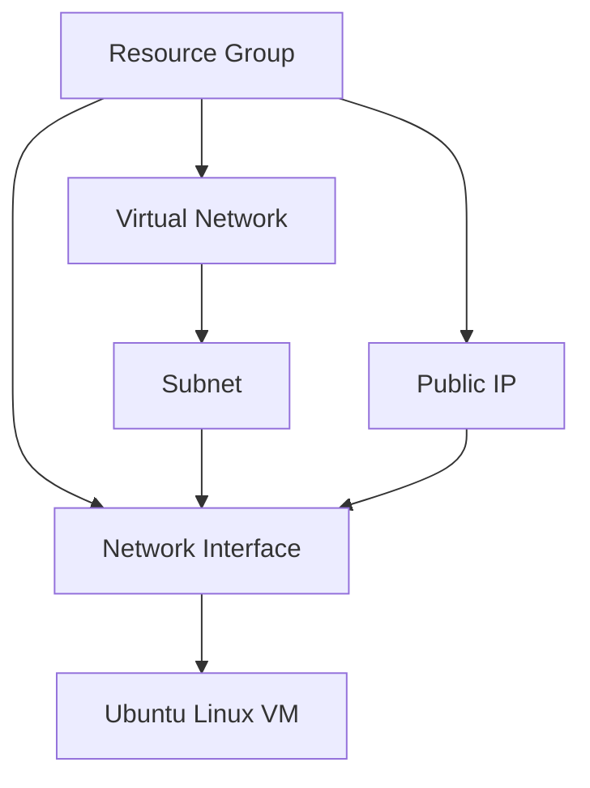

# Terraform Azure Ubuntu VM with Azure DevOps Agent

## Description

This project deploys an Ubuntu Linux Virtual Machine on Microsoft Azure using Terraform. The VM is preconfigured with the Azure DevOps agent installed and registered, allowing seamless integration into your CI/CD pipelines.

## Architecture



## Prerequisites

- Azure Subscription with Contributor permissions
- Azure CLI installed and logged in
- Terraform v1.3.0 or later installed
- Azure DevOps Personal Access Token (PAT) with Agent Pools Manage permissions
- Service Principal (if using remote backend authentication)

## Installation

1. Clone the repository

```bash
git clone https://github.com/yourrepo/terraform-azure-ubuntu-vm.git
cd terraform-azure-ubuntu-vm
```

2. Rename `terraform.tfvars.example` to `terraform.tfvars` and fill in your values.

3. Initialize Terraform

```bash
terraform init
```

4. Plan the deployment

```bash
terraform plan
```

5. Apply the deployment

```bash
terraform apply
```

## Configuration

- Variables are declared in `variables.tf`.
- Sensitive data such as `admin_password` and `devops_agent_pat` should be stored securely.
- Tags are applied uniformly to all resources.

## GitHub Actions Secrets

To enable CI/CD via GitHub Actions, configure the following secrets in your repository settings:

- `ARM_CLIENT_ID` - Azure Service Principal client ID
- `ARM_CLIENT_SECRET` - Azure Service Principal client secret
- `ARM_SUBSCRIPTION_ID` - Azure subscription ID
- `ARM_TENANT_ID` - Azure tenant ID

## Terraform Commands

- `terraform init` - Initialize Terraform
- `terraform fmt` - Format Terraform files
- `terraform validate` - Validate configuration
- `terraform plan` - Show execution plan
- `terraform apply` - Apply changes
- `terraform destroy` - Destroy infrastructure

## Usage Example

Deploy to dev environment:

```bash
terraform apply -var="environment=dev"
```

## Troubleshooting

- Ensure your Azure credentials have the necessary permissions.
- Validate your Terraform files with `terraform validate`.
- Check Azure portal for resource provisioning errors.

## Estimated Costs

- VM: Standard_B2s approx. $0.041/hour
- Storage: Standard_LRS
- Network: Minimal public IP usage costs

Monitor actual costs via Azure Cost Management.
